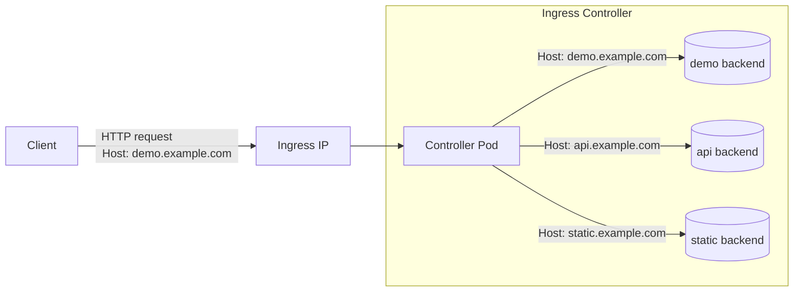

## What is kubernetes?

- Container orchestrator
- Kubernetes reconciles _desired state_ (YAML/CLI) with _actual state_ by running controllers in a control plane.
- You describe what you want (e.g., 2 replicas of an app). Controllers make/keep it true.

## What Kubernetes consists of

- **API Server**: front door for all CRUD on cluster resources.
- **etcd**: strongly-consistent key-value store for cluster state.
- **Scheduler**: places unscheduled pods on nodes based on constraints.
- **Controller Manager**: runs reconcilers (e.g., Deployment → ReplicaSet → Pods).
- **kubelet** (node): ensures containers for assigned pods are running.
- **Container runtime** (node): e.g., containerd handling images/containers.
- **kube-proxy** (node): programs node iptables/iptables-nft to implement Services.
- **CNI plugin** (cluster networking): gives pods IPs and cross-node connectivity.
- Optional but common: **Ingress Controller** (e.g., ingress-nginx) to implement Ingress.

## Create kind cluster

```bash
kind create cluster --config kind-config.yaml
```

## Create namespace

```bash
kubectl apply -f manifests/00-namespace.yaml
```

## Deploy a simple backend

```bash
kubectl apply -f manifests/01-backend.yaml
```

- controller-manager: Deployment -> ReplicaSet -> Pods
- kube-scheduler: binds pods to nodes.

## Create a service for the backend

```bash
kubectl apply -f manifests/02-service.yaml
```

- Stable virtual IP for multiple pods
- kube-proxy: updates node iptables to route to Pod IPs
- EndpointSlice: actual IPs for the pods

## In-cluster service discovery

Create a pod with curl

```bash
kubectl apply -f manifests/03-curler.yaml
```

exec into curler and call the service by FQDN (fully qualified domain name)

```bash
curl http://demo-svc
```

Should print "hello from demo-backend"

## 5 Adding an ingress

Install an Ingress controller (ingress-nginx). If you use Helm:

```bash
helm repo add traefik https://traefik.github.io/charts
helm repo update
helm install traefik traefik/traefik \
  -n traefik \
  --create-namespace
```



Port-forward to your machine (Kind has no cloud LoadBalancer):

```bash
kubectl -n traefik port-forward svc/traefik 8000:80
```

Create ingress resource

```bash
kubectl apply -f manifests/04-ingress.yaml
```

Map host locally and test

```bash
echo "127.0.0.1 demo.local" | sudo tee -a /etc/hosts
curl -s http://demo.local:8000/
```

## Other useful features in kubernetes

- Resources and Limits
- ConfigMaps and Secrets
- Pod Security Standards
- Affinity and TopologySpreadConstraints
- PodDisruptionBudget
- Readiness and Liveness probes
- CoreDNS
- Observability

## Bonus un-magic-ifying example

Services are implemented using iptables

exec into kind node

```bash
docker exec -it kind-worker bash
```

Check all iptables

```bash
iptables-nft-save
```

Check all demo-svc iptables

```bash
iptables-nft-save | grep demo/demo-svc:http
```

- `KUBE-SEP-*` are backing endpoints for pods that ensure traffic is masqueraded and DNATted properly
- `KUBE-SERVICES` matches the service we created
- `KUBE-SVC-*` are round robin routes
