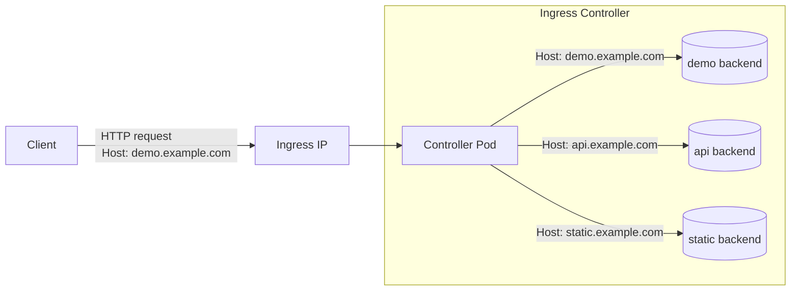

## Prerequisites

- `Docker` or similar (for running kind nodes)
- `kind`
- `kubectl` inslled
- `helm` installed
- Optional but nice:
  - **k9s**: terminal UI for Kubernetes that you can use instead of many `kubectl` commands

## What is Kubernetes?

- Kubernetes is a container orchestrator which means it manages containers running in pods inside the kubernetes cluster.
- Kubernetes is declarative which means it reconciles _desired state_ with _actual state_.
  - You describe what you want (e.g., 2 replicas of an app). Kubernetes.
- You mostly interact with Kubernetes via:
  - `kubectl` (CLI), or
  - **k9s** (TUI), which wraps `kubectl` and lets you navigate resources interactively.

## What Kubernetes consists of

- **API Server**: front door for all CRUD on cluster resources.
- **etcd**: strongly-consistent key-value store for cluster state.
- **Scheduler**: places unscheduled pods on nodes based on constraints.
- **Controller Manager**: runs reconcilers (e.g., Deployment → ReplicaSet → Pods).
- **kubelet** (node): ensures containers for assigned pods are running.
- **Container runtime** (node): e.g., containerd handling images/containers.
- **kube-proxy** (node): programs node iptables/iptables-nft to implement Services.
- **CNI plugin** (cluster networking): gives pods IPs and cross-node connectivity.
- Optional but typical: **Ingress Controller** (e.g., Traefik) to implement Ingress.

## Demo

All but the apply `kubectl` commands in this guide, can be done in **k9s** instead which gives a better overview for many.
For instance, `kubectl get pods -A` is achieved by typing `:pods` in **k9s**.

### Create kind cluster

```bash
kind create cluster --config manifests/kind-config.yaml
```

Check that everything is ready:

```bash
kubectl get nodes
kubectl get pods -A
```

Or just open **k9s** to inspect the cluster.

### Create namespace

```bash
kubectl apply -f manifests/00-namespace.yaml
```

Confirm:

```bash
kubectl get ns
kubectl get pods -n demo
```

In **k9s**, you can hit `:ns demo` to switch to the namespace.

### Deploy a simple backend

```bash
kubectl apply -f manifests/01-backend.yaml
```

Watch the Deployment and Pods:

```bash
kubectl get deploy -n demo
kubectl get rs -n demo
kubectl get pods -n demo
```

Or `:dp`, `:replicasets`, `:pods`

- controller-manager: Deployment -> ReplicaSet -> Pods
- kube-scheduler: binds pods to nodes

### Create a service for the backend

```bash
kubectl apply -f manifests/02-service.yaml
```

Inspect the Service and its endpoints:

```bash
kubectl get svc -n demo
kubectl describe svc demo-svc -n demo

kubectl get endpointslices -n demo
kubectl get endpointslices -n demo | grep demo-svc
```

Or check those out in **k9s** (hint: you can hit enter on a service in **k9s** to see all backing pods).

- Stable virtual IP for multiple pods
- kube-proxy: updates node iptables to route to Pod IPs
- EndpointSlice: actual IPs for the pods

### In-cluster service discovery

Create a pod with curl:

```bash
kubectl apply -f manifests/03-curler.yaml
```

Check the pod:

```bash
kubectl get pods -n demo -l app=curler
```

Exec into curler and call the service by DNS name:

```bash
kubectl exec -n demo -it deploy/curler -- sh
curl http://demo-svc
```

Or hit `s` on the pod in **k9s**.

Should print:

```text
hello from demo-backend
```

### Adding an ingress

Install an Ingress controller (Traefik in this example):

```bash
helm repo add traefik https://traefik.github.io/charts
helm repo update
helm install traefik traefik/traefik \
  -n traefik \
  --create-namespace
```

Check that the controller is running:

```bash
kubectl get pods -n traefik
kubectl get svc -n traefik
```

All ingress to the cluster goes through a single IP to hit the ingress controller.
Requests are routed by the ingress controller based on the `Host` header in the request.
See the diagram below.



Port-forward to your machine (Kind has no cloud LoadBalancer):

```bash
kubectl -n traefik port-forward svc/traefik 8000:80
```

Create ingress resource:

```bash
kubectl apply -f manifests/04-ingress.yaml
```

And inspect them:

```bash
kubectl get ingress -n demo
kubectl describe ingress demo-ingress -n demo
```

Map host locally and test.

> **Note on `/etc/hosts`**
> The command below works _as written_ on Linux.
>
> - On **Linux/macOS**, the hosts file is `/etc/hosts`, but on macOS you’d typically edit it with a text editor (`sudo nano /etc/hosts`).
> - On **Windows**, you need to edit `C:\Windows\System32\drivers\etc\hosts` manually as Administrator and add the equivalent line.

Linux example:

```bash
echo "127.0.0.1 demo.local" | sudo tee -a /etc/hosts
```

And check that the ingress works:

```bash
curl -s http://demo.local:8000/
```

Or go to `demo.local:8000` in your browser.

You should see the same response from the backend, but now via Ingress.

---

### Other useful features in Kubernetes

#### Resources and Limits

```bash
kubectl apply -f manifests/useful-features/05-resources-and-limits.yaml
```

#### ConfigMaps and Secrets

```bash
kubectl apply -f manifests/useful-features/06-configmap-and-secret.yaml
```

#### Pod Security Standards

Create a restricted pod security namespace:

```bash
kubectl apply -f manifests/useful-features/07-1-restricted-namespace.yaml
```

Create a privileged container (should not be allowed)

```bash
kubectl apply -f manifests/useful-features/07-2-pod-security-standards.yaml
```

Check that the deployment was not allowed

```bash
kubectl get pod demo-pss-restricted -n demo-pss-restricted -o yaml
```

Uncomment the comments in [the deployment file](./manifests/useful-features/07-2-pod-security-standards.yaml) and apply it again.

```bash
kubectl apply -f manifests/useful-features/07-2-pod-security-standards.yaml
```

Now the deployment should be allowed and the pods should start.

#### Affinity and TopologySpreadConstraints

```bash
kubectl apply -f manifests/useful-features/08-topology-spread-constraints.yaml
```

#### PodDisruptionBudget

```bash
kubectl apply -f manifests/useful-features/09-pod-disruption-budget.yaml
```

#### Readiness and Liveness probes

```bash
kubectl apply -f manifests/useful-features/10-probes.yaml
```

In **k9s**, most of this is one keystroke away (pods → `y` for yaml spec, `d` for describe, etc.).

## Bonus un-magic-ifying example

Services are implemented using iptables.
You can see the kind nodes running as docker containers:

```bash
docker ps
```

Exec into kind node (e.g., `kind-worker`):

```bash
docker exec -it kind-worker bash
```

Check all iptables:

```bash
iptables-nft-save
```

Check all demo-svc iptables rules:

```bash
iptables-nft-save | grep demo/demo-svc:http
```

- `KUBE-SEP-*` are backing endpoints for pods that ensure traffic is masqueraded and DNATted properly
- `KUBE-SERVICES` matches the service we created
- `KUBE-SVC-*` are round robin routes

## Clean up

Delete the kind cluster

```bash
kind delete cluster
```
